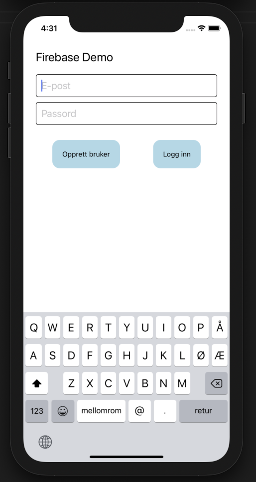

## Oppgave 2: Litt koding

1. Start med å erstatte innholdet i `app.tsx` med en skjerm for å opprette bruker/logge inn.
   Komponenter brukt i eksempel:

- `<Text />` for tekstinnhold
- `<TextInput />` for input-felt
- `<Pressable />` for knapper

2. Opprett to funksjoner som de knappene skal kalle: `onCreateUserClick()` og `onSignInClick`

#### [Oppgave 3 – Legg til Firebase](Oppgave3_legg_til_firebase.md)
