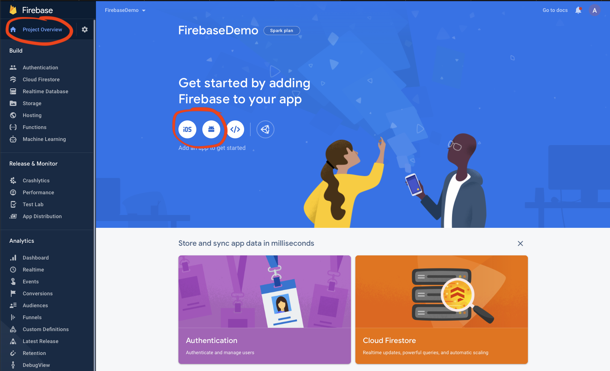
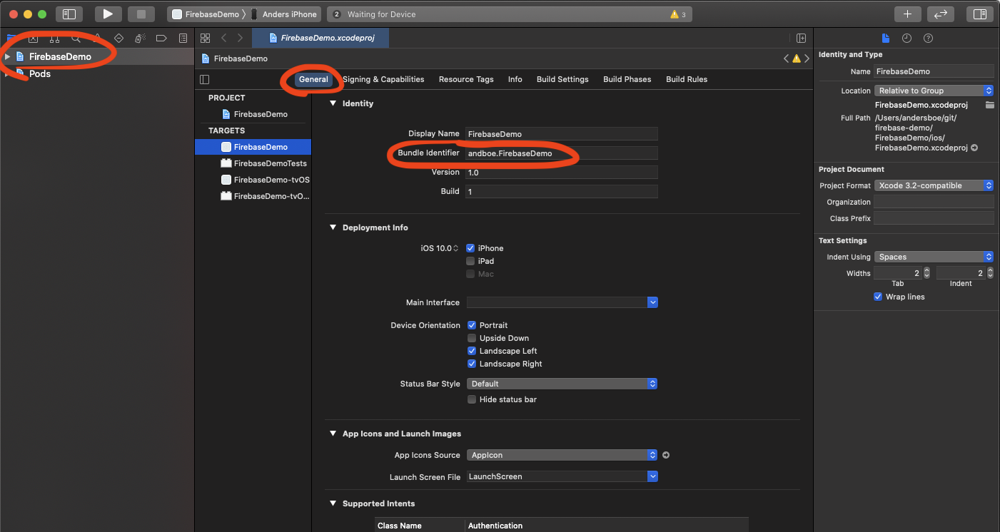

## Oppgave 3: Legg til Firebase

1.  Logg inn og opprett et nytt prosjekt i Firebase-konsollen.  
    [https://console.firebase.google.com](https://console.firebase.google.com)
2.  Legg til en native app!  
    For iOS:
        
        a) iOS: bundle-id finner du enklest ved å åpne prosjektet i Xcode (`FirebaseDemo.xcworkspace` i `ios` mappen), klikk på «FirebaseDemo» øverst til venstre og velg en passende bundle-identifier.
        b) Last ned GoogleService-Info.plist og dra inn i prosjektet som beskrevet. (Via Xcode!) - Husk å huk av på «Copy items if needed» i Xcode dialogen
        c) Hopp over steg 3 og 4


    For Android:

        a) «Package name» er det samme som `ApplicationId` som du finner i `build.gradle` under `/android/app/`. Ikke endre denne(!!)
        b) Last ned `google-services.json` filen og legg til i prosjektet som beskrevet
        c) Hopp over steg 3

 

Nå har vi opprettet en firebase-app i skyen, og alt som gjenstår er å legge til firebase-SDKet i appen vår, og koble dette sammen!

For dette skal vi bruke 3. parts biblioteket `react-native-firebase` fra Invertase ([https://rnfirebase.io](https://rnfirebase.io))

1.  Installer fra rot-mappen til prosjektet: `npm install --save @react-native-firebase/app` eller `yarn add @react-native-firebase/app`
2.  Android setup:

    a) I filen `/android/build.gradle` legg til:

    ```
    buildscript {
    	dependencies {
    	_// ... andre avhengigheter_
    		classpath("com.google.gms:google-services:4.3.3")
    	}
    }
    ```

    b) I filen `/android/app/build.gradle` legg til denne på linje 2:

    ```
    apply plugin: 'com.google.gms.google-services'
    ```

    c) Appen skal nå kunne bygges og kjøres problemfritt på Android med `npm run android`!

3.  iOS setup
    a) Øverst i filen `AppDelegate.m`, legg til

    ```
    #import <Firebase.h>
    ```

    b) I metoden `didFinishLaunchingWithOptions` i samme fil, legg til:

    ```
    if ([FIRApp defaultApp] == nil) {
    	[FIRApp configure];
    }
    ```

    c) Gå inn i mappen `ios` og oppdater pods med

    ```
    pod install --repo-update
    ```

    d) Appen skal nå kunne bygges og kjøres problemfritt på iOS med `npm run ios`!

#### [Oppgave 4 – Autentisering](Oppgave4_autentisering.md)
