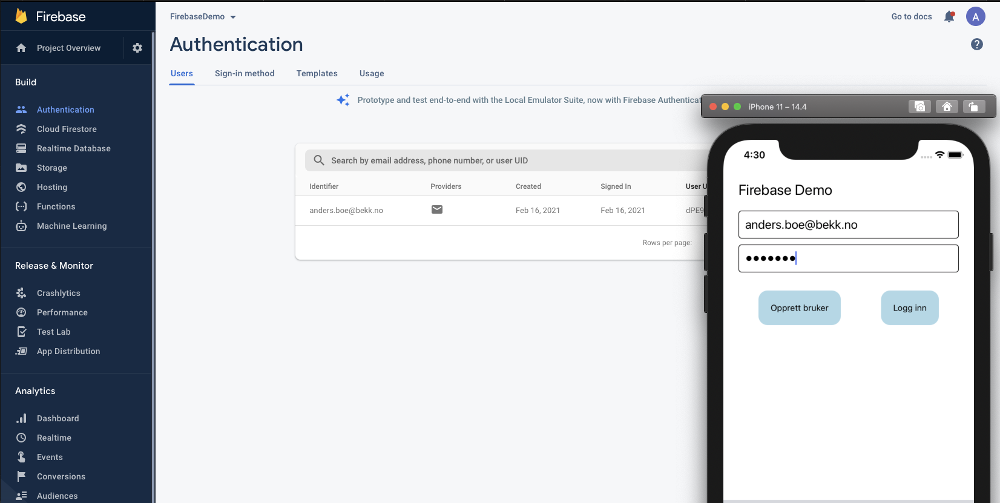

## Oppgave 4: Autentisering

I denne delen skal vi opprette brukere og tillate innlogging med epost/passord.

1.  I Firebase consolen, velg «Authentication» øverst til venstre.
2.  Klikk på «Get started», og aktiver «Email/password»


På tide å hoppe over til koden!

3.  Først må vi legge til `auth`, kjør

    ```
    yarn add @react-native-firebase/auth
    // if iOS
    cd ios && pod install
    ```

4.  I `App.tsx` importer auth med
    ```
    import auth from '@react-native-firebase/auth';
    ```

Om editoren klager på at pakken ikke finnes, kjør en runde med `npm install`.

5.  Oppdater funksjonen for knappen som oppretter en bruker (`onCreateUserClick`), og send inn verdiene fra input-feltene. Vi kan lage en ny bruker med

    ```
    auth().createUserWithEmailAndPassword(email, password)
    ```

    Merk at man også blir autentisert hvis operasjonen over går fint!

6.  Forsøk å opprette en bruker. Husk at appen må bygges på nytt etter å ha lagt til et nytt bibliotek (npm run ios/android). Verifiser i firebase-konsollen ved å klikke på «Users» at brukeren din har blitt opprettet.



7.  La oss vise frem i appen om brukeren er innlogget!  
    Lag en hook med `useEffect` som lytter på endringer via `auth().onAuthStateChanged(user => {})`  
    Vis frem eposten til brukeren som er logget inn (`user.email`)
8.  Lag en logg-ut knapp, som logger ut brukeren med `auth().signOut()`

9.  Gjør loginknappen brukbar ved å oppdatere `onSignInClick` med `auth().signInWithEmailAndPassword(email, password)` for å kunne logge inn igjen
10. Bonus! Legg på validering av epost, og vis evt en feilmelding om noe går galt.  
    Her er en snasen regex for epost-verifikasjon.  
     `` (?:[a-z0-9!#$%&'*+/=?^_`{|}~-]+(?:\.[a-z0-9!#$%&'*+/=?^_`{|}~-]+)*|"(?:[\x01-\x08\x0b\x0c\x0e-\x1f\x21\x23-\x5b\x5d-\x7f]|\\[\x01-\x09\x0b\x0c\x0e-\x7f])*")@(?:(?:[a-z0-9](?:[a-z0-9-]*[a-z0-9])?\.)+[a-z0-9](?:[a-z0-9-]*[a-z0-9])?|\[(?:(?:(2(5[0-5]|[0-4][0-9])|1[0-9][0-9]|[1-9]?[0-9]))\.){3}(?:(2(5[0-5]|[0-4][0-9])|1[0-9][0-9]|[1-9]?[0-9])|[a-z0-9-]*[a-z0-9]:(?:[\x01-\x08\x0b\x0c\x0e-\x1f\x21-\x5a\x53-\x7f]|\\[\x01-\x09\x0b\x0c\x0e-\x7f])+)\]) ``

11. Bonus 2! Opprett et felt for å fylle ut navn. Ved klikk på en knapp oppdater navnet (displayName) for brukerene ved hjelp av `user.updateProfile({ displayName: <name> })`

#### [Oppgave 5 – Database](Oppgave5_database.md)
