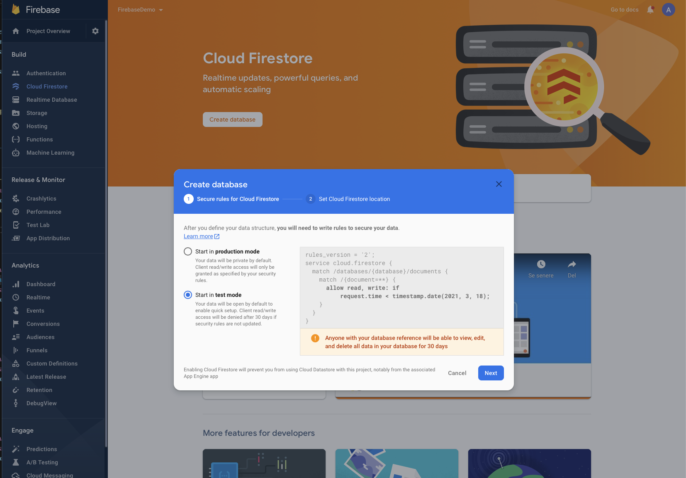
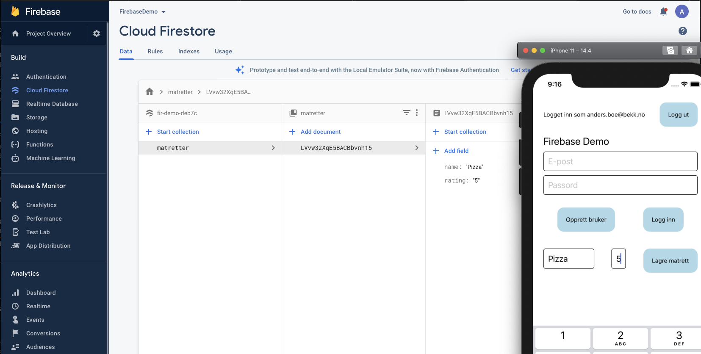
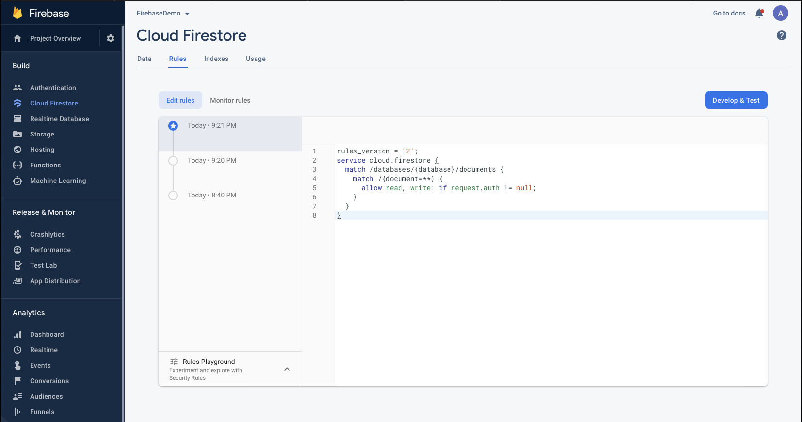

## Oppgave 5: Database

I denne delen skal vi koble opp mot firebase sin NoSQL database Cloud Firestore, for å lagre og hente data. Kort fortalt ligger all data lagret som «Documents», samlet i «Collections». Her skal vi bygge opp en «Collection» kalt matretter, som skal inneholde flere «Documents» som vil være ulike matretter, med en rating.

1.  I Firebase consolen, velg «Cloud Firestore» nest øverst til venstre.
2.  Klikk på «Create database», velg «test mode» og en EU-region.



Kode tid!

3.  Legg til firestore med
    ```
    yarn add @react-native-firebase/firestore
    // if iOS
    cd ios && pod install
    ```
4.  Importer firestore i `App.tsx` med
    ```
    import firestore from '@react-native-firebase/firestore';
    ```
5.  Lag to inputfelt, henholdvis navn på matrett, rating (tall) og en knapp som skal sende innholdet fra inputfeltene til databasen. Eksempel for å legge til et nytt dokument for en gitt collection:

    ```
    await firestore().collection('matretter').add({
    		name: dish,
    		rating: rating,
    });
    ```

    Voilà! Nå skal du kunne lagre matretter med rating i den nye databasen! Verifiser i firebase at innholdet dukker opp.

    

6.  Nå kan hvemsomhelst skrive og lese fra databasen, det ønsker vi ikke! Man kan lage komplekse regler for hvem som skal ha tilgang til hva i databasen, men for å holde det enkelt skal vi legge opp et hinder som krever at du er logget inn.

    Velg «Rules» i Firebase-konsollen under Cloud Firestore. Endre reglen til å kun tillatte «read» og «write» hvis brukeren er autentisert, og publiser endringene.

    ```
    allow read, write: if request.auth != null;
    ```

    

7.  Verifiser at du kun får lagt til nye matretter hvis du er logget inn.
8.  Nå skal vi liste opp matrettene fra databasen vår! Legg til en ny knapp som henter matrettene fra Firestore.

    ```
    const query = await firestore().collection('matretter').get();
    		const dishes = query.docs.map((doc) => {
    		const data = doc.data();
    		return {name: data.name, rating: data.rating};
    });
    ```

    List opp alle matrettene f.eks med en `<FlatList />`

#### [Oppgave 6 – Videre utvikling](Oppgave6_videre_utvikling.md)
